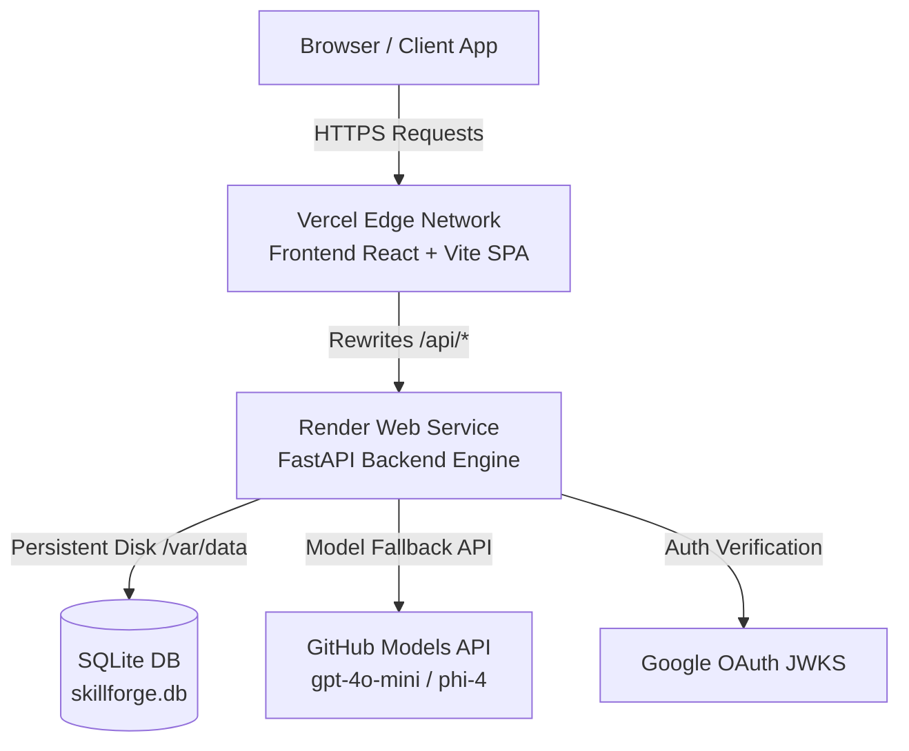

# Codempress Production Deployment & Operations Guide

Complete deployment manual for provisioning, building, and operating the **Codempress** platform across **Vercel** (frontend SPA), **Render** (FastAPI backend), and **Persistent Storage / SQLite**.

---

## 🏗️ Architecture Overview



- **Frontend**: Hosted on Vercel. Static single-page app (React + Vite + Three.js + PWA).
- **API Proxy**: Vercel `vercel.json` rewrites `/api/*` requests to the Render backend service, avoiding CORS issues while supporting custom domains.
- **Backend Engine**: Hosted on Render. Python 3.10 ASGI server powered by FastAPI and Uvicorn.
- **Data Persistence**: Render Persistent Disk mounted at `/var/data` storing `skillforge.db`. Automated schema creation and content seeding on first run.

---

## 🔧 Production Environment Variables

### Render Backend Service (`.env.production`)

| Variable | Required | Description / Default |
| :--- | :--- | :--- |
| `ENV` | Yes | Set to `production`. |
| `DB_PATH` | Yes | Path to persistent database file: `/var/data/skillforge.db`. |
| `JWT_SECRET` | Yes | Secure 64-character secret for signing JWT tokens. |
| `GOOGLE_CLIENT_ID` | Yes | Google OAuth 2.0 Client ID for audience verification. |
| `GITHUB_TOKEN` | Yes | GitHub PAT with `models: read` scope for AI generation. |
| `ALLOWED_ORIGINS` | Yes | Comma-separated CORS origins (e.g. `https://codempress.vercel.app`). |
| `GITHUB_MODELS_ENDPOINT` | No | Defaults to `https://models.github.ai/inference/chat/completions`. |

### Vercel Frontend Service (`frontend/.env.production`)

| Variable | Required | Description / Default |
| :--- | :--- | :--- |
| `VITE_API_URL` | Yes | Relative API endpoint `/api` (rewritten by Vercel) or full backend URL. |
| `VITE_GOOGLE_CLIENT_ID` | Yes | Google OAuth 2.0 Client ID (matching backend). |

---

## 🚀 1. Render Backend Deployment Workflow

### Option A: Automatic Blueprint Deployment (Recommended)
1. Log in to [Render Dashboard](https://dashboard.render.com).
2. Click **New +** $\rightarrow$ **Blueprint**.
3. Select your repository (`https://github.com/Hrudaideepak/codempress`).
4. Render automatically reads `render.yaml` and provisions:
   - Web Service `codempress-backend`
   - Persistent Disk `sqlite-data` (mounted at `/var/data`)
   - Auto-generated `JWT_SECRET`
5. Configure missing secrets in Render Dashboard:
   - `GITHUB_TOKEN` = `ghp_...`
   - `GOOGLE_CLIENT_ID` = `679239699589-urpbqdd50nvop2hgkeuc508q850glfj1.apps.googleusercontent.com`
   - `ALLOWED_ORIGINS` = `https://codempress.vercel.app,http://localhost:5173`

### Option B: Manual Web Service Setup
- **Environment**: `Python 3`
- **Build Command**: `pip install -r requirements.txt && python content/seed_topics.py`
- **Start Command**: `python -m uvicorn backend.main:app --host 0.0.0.0 --port $PORT`
- **Health Check Path**: `/api/health`
- **Disk Mount**:
  - Name: `sqlite-data`
  - Mount Path: `/var/data`
  - Size: `1 GB`

---

## ⚡ 2. Vercel Frontend Deployment Workflow

### Option A: Vercel Dashboard (Connected Repository)
1. Go to [Vercel New Project](https://vercel.com/new).
2. Import `codempress`.
3. Configure Project Settings:
   - **Framework Preset**: `Vite`
   - **Root Directory**: `./` (or `frontend` if configured as sub-project)
   - **Build Command**: `cd frontend && npm install && npm run build`
   - **Output Directory**: `frontend/dist`
4. Add Environment Variables:
   - `VITE_API_URL` = `/api`
   - `VITE_GOOGLE_CLIENT_ID` = `679239699589-urpbqdd50nvop2hgkeuc508q850glfj1.apps.googleusercontent.com`
5. Deploy.

### Option B: CLI Deployment
```bash
# Using CLI script
./scripts/deploy_vercel.sh

# Or via PowerShell on Windows
.\scripts\deploy_vercel.ps1
```

---

## 🛠️ 3. CLI Deployment Scripts & Verification

### Deploy Scripts
- **Render Deployment**:
  ```bash
  export RENDER_DEPLOY_HOOK_URL="https://api.render.com/deploy/srv-xxx?key=yyy"
  ./scripts/deploy_render.sh
  ```
- **Vercel Deployment**:
  ```bash
  export VERCEL_TOKEN="your_vercel_token"
  ./scripts/deploy_vercel.sh
  ```

### Verification Script
Run the automated pre-flight & verification suite:
```bash
python scripts/verify_deployment.py --backend https://codempress-backend.onrender.com --frontend https://codempress.vercel.app
```

Expected verification output:
```text
🔍 Testing: 1. Backend Direct Health (/api/health) ... ✅ PASSED
🔍 Testing: 2. AI Model Pipeline Status (/api/ai/status) ... ✅ PASSED
🔍 Testing: 3. Database Topics Query (/api/topics) ... ✅ PASSED
🔍 Testing: 4. Vercel Frontend SPA Root ... ✅ PASSED
🔍 Testing: 5. Vercel Backend Rewrite Proxy (/api/health) ... ✅ PASSED

🎉 ALL PRODUCTION DEPLOYMENT CHECKS PASSED SUCCESSFULLY!
```

---

## 🔄 4. GitHub Actions CI/CD Pipeline

The `.github/workflows/deploy.yml` pipeline automates continuous integration and delivery:
1. **Integration Tests**: Executes `pytest` backend test suite and seeds topics.
2. **Container Build**: Compiles Docker images for backend & frontend validation.
3. **Android APK Build**: Builds Capacitor Android debug package.
4. **Deploy to Render**: Calls Render Deploy Hook on pushes to `main`.
5. **Deploy to Vercel**: Runs `vercel-action` on pushes to `main`.
6. **Automated Verification**: Runs `verify_deployment.py` against production endpoints.

---

## 📋 5. Production Pre-Flight Checklist

- [x] Backend database file stored on persistent disk (`/var/data/skillforge.db`).
- [x] Backend `/api/health` returns `200 OK` with status `healthy`.
- [x] Backend `/api/ai/status` reports active GitHub Models pipeline.
- [x] Vercel `vercel.json` rewrites `/api/*` to Render backend URL.
- [x] CORS origins match production domain.
- [x] `JWT_SECRET` configured securely in Render dashboard.
- [x] Service worker `/sw.js` delivered with `no-cache` headers.
